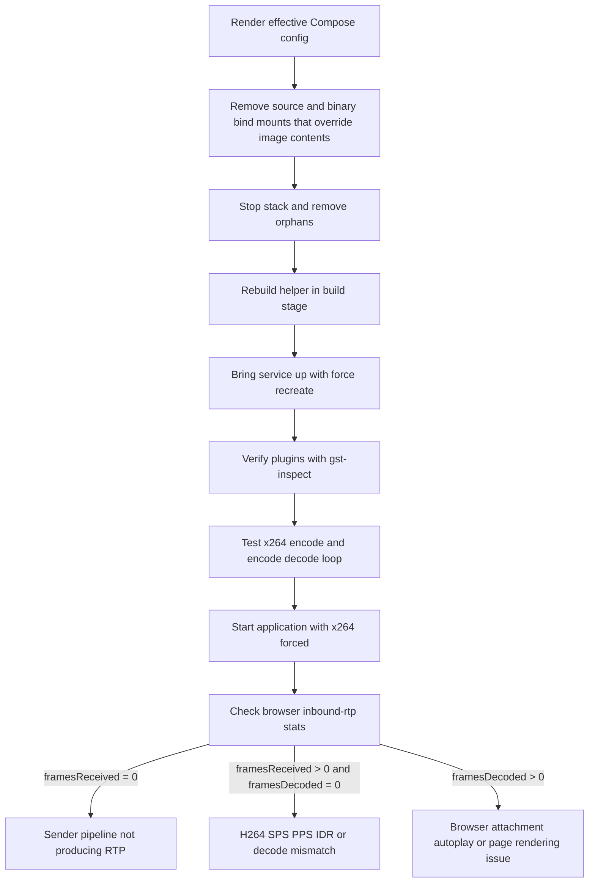
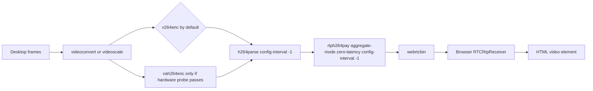

# Resolving Blank Video in a Dockerized noVNC WebRTC Remote Desktop Stack

## Executive summary

Your symptom set points much more strongly to a **server-side video production failure** than to a signaling or control-plane failure. In WebRTC, `RTCPeerConnection.connectionState = "connected"` means the ICE/DTLS transports are established, but it does **not** prove that useful media frames are being produced or decoded. A `MediaStreamTrack` that is `live` but `muted` means the track currently cannot provide media output, and an attached video element with `videoWidth = 0` means the browser still has no intrinsic frame dimensions to render. Put together, that is consistent with “transport exists, video receiver exists, but no decodable video frames are arriving at the element yet.” citeturn22view3turn22view0turn22view2turn22view1

The highest-confidence remediation is to stop live-patching the running container, remove any source bind mounts that can obscure the image’s baked-in files, rebuild from a single source of truth, and make **software H.264 via `x264enc`** the default path. That recommendation is grounded in the facts that `vah264enc` depends on a working VA-API driver at runtime, while `x264enc` is a pure software encoder with documented low-latency tuning knobs such as `tune=zerolatency`, `speed-preset`, and `key-int-max`. Docker’s bind-mount semantics also explain why an apparently “patched” file can still look old inside the running container: bind mounts obscure the container’s pre-existing contents at the mount target. citeturn30view2turn20view1turn20view2turn20view3turn27view0turn27view2

A clean path forward is therefore: render the effective Compose model, remove orphans and stale overrides, rebuild with a multi-stage Dockerfile that compiles the helper in a build stage, verify encoder/plugin availability with `gst-inspect-1.0`, run explicit `gst-launch-1.0` tests for `x264enc` first, and only then bring the app back up. If video still stays blank after switching to `x264enc`, the next most likely issue is **H.264 parameter-set / keyframe delivery** in the RTP path; in that case, test browser `inbound-rtp` stats and ensure `h264parse` / `rtph264pay` inject SPS/PPS and WebRTC-friendly packetization settings. citeturn19search0turn19search2turn26view2turn31search16turn8search4turn8search7turn21view1turn21view2turn23view0turn23view1turn23view2turn23view3

TLS on port `6081` should still be fixed for production, but based on the current evidence it is **not** the proximate cause of the blank video. Audio is already flowing and the peer is already connected, so the shortest path to a picture is to stabilize the encoder and container build path first. Separately, because a NAS sudo password was shared in the conversation, it should be rotated, along with any related secrets in Compose env files or shell history. citeturn22view3turn33search2turn33search8turn33search11

## What the symptom pattern actually means

The browser symptom of **audio live/unmuted** alongside **video live/muted/0x0** is important because it narrows the fault domain. It says the page negotiated a peer connection, created a video receiver, and attached some video track object to the page, but that track is not currently yielding renderable media. In practical terms, that usually means the break is in the **video sender pipeline**, **encoder**, **payloading**, or **decode preconditions** rather than in the generic transport or control channel. citeturn22view3turn22view0turn22view2turn22view1

The VA-API failure you observed is a particularly strong fit. `vah264enc` is explicitly a VA-API-based hardware H.264 encoder that uses the installed and selected VA driver, and VA-API utilities require an actual driver implementation to operate. GStreamer’s DRM VA display wrapper also returns `NULL` when the render device cannot be opened and initialized. That means **plugin presence is not enough**: you can have `vah264enc` registered in the plugin registry and still have it fail at runtime because the underlying driver or render node is unusable. citeturn30view2turn13search4turn13search2turn13search10

A second high-probability factor is the stale source mount. Docker documents that bind-mounting into a non-empty directory obscures the image’s pre-existing contents at that path. If your helper source or helper binary path is still bind-mounted from the NAS, a fresh image rebuild can easily appear to “do nothing” because the container keeps seeing the mounted host copy instead of the rebuilt image copy. citeturn27view0turn27view2

A third factor is the runtime/build split. Docker recommends multi-stage builds precisely so you can compile in one stage and copy the finished artifact into a smaller runtime image. That matters here because trying to compile in a stripped runtime image is exactly how you get the `pkg-config` / `gcc` failures you saw. `pkgconf` exists to supply compiler and linker flags for development frameworks, and Debian’s `build-essential` exists specifically to make package builds possible. citeturn19search0turn19search2turn17search2turn16search3

Finally, if you switch to `x264enc` and the track is still blank, the next thing to suspect is H.264 stream usability inside the RTP/WebRTC leg. `h264parse` and `rtph264pay` both expose `config-interval`; setting `-1` causes SPS/PPS to be sent with every IDR frame, and `rtph264pay` explicitly recommends `aggregate-mode=zero-latency` for WebRTC. On the browser side, `inbound-rtp` stats let you distinguish “frames are not arriving” from “frames arrive but are not decodable”: `framesReceived`, `framesDecoded`, `keyFramesDecoded`, `frameWidth`, and `frameHeight` are the quickest indicators. citeturn21view1turn21view2turn23view0turn23view1turn23view2turn23view3turn24search1turn24search2

| Likely cause | Why it fits your evidence | What would confirm it most quickly | Remediation priority |
|---|---|---|---|
| Helper still selecting `vah264enc` even when hardware is optional | You already saw VA init errors, while `vah264enc` depends on a working VA-API driver at runtime | Helper logs show encoder selection; `gst-launch-1.0 ... ! vah264enc ! ...` fails while `x264enc` succeeds | Highest |
| Stale bind-mounted helper source or binary | Docker bind mounts obscure image contents, so rebuilt code can be hidden by the mounted path | `docker inspect` shows a bind mount on the helper source/binary path | Highest |
| Runtime image missing build tooling and dev headers | Explains failed hotfix compile and makes runtime patching brittle | `command -v gcc` / `pkg-config` fail in container | High |
| H.264 parameter-set or keyframe delivery problem | Can produce connected peers with non-rendering video if frames are not decodable | Browser `framesReceived > 0` but `framesDecoded = 0`, `keyFramesDecoded = 0` | Medium |
| noVNC/browser cache mismatch after upgrade | Query-string deployment plus cached JS can cause confusing upgrade behavior | Hard refresh changes behavior; server lacks `Cache-Control: no-cache` | Secondary |

The table above is based on Docker’s bind-mount and Compose behavior, GStreamer encoder/payloader/parser docs, browser media semantics, and noVNC’s own deployment guidance for query-string based pages. citeturn27view0turn27view2turn26view2turn30view2turn30view0turn21view1turn21view2turn22view0turn22view1turn25view0turn25view1

## The target remediation path

The right operational model is: **host source is authoritative at build time, image artifact is authoritative at runtime**. In other words, build from the patched source, bake the helper into the image, and at runtime mount only data/config paths that truly need to stay external. Do not mount helper source code or helper binary targets into the running application container unless you deliberately want host files to override the image. Docker’s build-context docs, `.dockerignore` behavior, multi-stage build guidance, and bind-mount semantics all point in the same direction. citeturn32search0turn32search4turn19search0turn19search2turn27view0

Your helper should also change its encoder-selection logic so that “hardware available” means **more than just `gst_element_factory_find("vah264enc") != NULL`**. The safer policy is:

1. If an explicit encoder is requested, try that first.
2. If hardware is required, try only hardware encoders and fail fast with a clear log.
3. If hardware is optional, **probe** hardware encoders and fall back automatically if creation, state change, caps negotiation, or a short self-test fails.
4. Prefer `x264enc` as the default until VA-API is proven healthy on this NAS.
5. Log the selected encoder and the exact pipeline string.

That policy follows directly from the gap between plugin registration and actual runtime device/driver usability in the VA stack. citeturn30view2turn13search4turn13search2



Compose’s own docs support this flow: `docker compose config` renders the merged, normalized model that will actually be applied; `docker compose down --remove-orphans` removes containers for services no longer defined; `docker compose build --no-cache` forces a clean rebuild; and `docker compose up --build --force-recreate` rebuilds and recreates containers even when Compose would otherwise think nothing changed. citeturn26view2turn26view1turn26view0turn37view0turn37view2

## Encoder strategy and pipeline design

For this deployment, the safest encoder policy is to **default to software H.264 via `x264enc`**, keep `openh264enc` as a tertiary software fallback if needed, and reserve `vah264enc` for an explicit or successfully probed hardware path. That is not because `vah264enc` is inherently wrong, but because its success depends on a healthy VA-API driver, render-node access, and compatible userspace. By contrast, `x264enc` is a software encoder with explicit low-latency tuning support, and RFC 7742 / MDN both identify H.264 Constrained Baseline as part of WebRTC’s interoperability baseline, making a constrained-baseline software path a very reasonable default for browser-facing real-time video. citeturn30view2turn30view0turn20view1turn20view2turn20view3turn36search0turn36search1turn36search3



### Encoder comparison

| Encoder | Official classification | Input/output characteristics | What it is good for here | Main risk in your case | Recommended behavior |
|---|---|---|---|---|---|
| `vah264enc` | Hardware H.264 encoder in GStreamer’s `va` plugin | Accepts NV12 in system memory or VAMemory; outputs H.264 | Highest efficiency **if** VA-API is healthy | Exactly the failure you are seeing: driver/render-node init can fail even though the element exists | Use only after a real runtime probe passes |
| `x264enc` | Software H.264 encoder in GStreamer’s `x264` plugin | Accepts multiple raw formats including I420 and NV12; outputs H.264 with controllable profile | Best default for reproducibility and low-latency tuning | Higher CPU usage than hardware | Make this the default and known-good baseline |
| `openh264enc` | Software H.264 encoder in GStreamer’s `openh264` plugin | Accepts I420 only; outputs H.264; documented as marginal rank | Useful fallback if `x264enc` is unavailable in the image | Narrower input caps and generally less attractive first choice | Keep as tertiary fallback |
| `qsvh264enc` | Intel Quick Sync H.264 encoder in GStreamer’s `qsv` plugin | Accepts NV12 in raw/VAMemory on Linux and D3D memory on Windows; outputs H.264 | Possible future Intel hardware path if your GStreamer build includes it | More environment-specific than `x264enc`; not a quick fix for this incident | Consider only after the software path is stable |

The table above is drawn from the official plugin docs for `vah264enc`, `x264enc`, `openh264enc`, `qsvh264enc`, and the WebRTC H.264 interoperability guidance in RFC 7742 / MDN. citeturn30view2turn30view0turn30view1turn30view3turn36search0turn36search1

A practical default software configuration for remote desktop latency is:

```text
x264enc tune=zerolatency speed-preset=veryfast key-int-max=30 bitrate=2500 ! \
video/x-h264,profile=constrained-baseline
```

That recommendation comes from the documented `x264enc` latency caveat, the existence of `tune=zerolatency`, the `speed-preset` and `key-int-max` controls, and the browser-side H.264 constrained-baseline interoperability requirement. citeturn20view1turn20view2turn20view3turn36search0turn36search1

If your helper manually constructs the H.264 RTP path, add:

```text
h264parse config-interval=-1 ! rtph264pay aggregate-mode=zero-latency config-interval=-1
```

`h264parse` and `rtph264pay` both document `config-interval`, and `rtph264pay` explicitly recommends `aggregate-mode=zero-latency` for WebRTC compatibility. citeturn21view1turn21view2

## Dockerfile and Compose audit

The most important Compose audit principle here is that you should inspect the **effective** model, not just one YAML file. Docker documents that Compose merges files and that `docker compose config` renders the actual, interpolated model that will be applied. That is the fastest way to discover a forgotten override file, profile, or volume mount that keeps reintroducing stale helper paths. citeturn12search2turn26view2

### Audit checklist

| Audit item | What “good” looks like | Why it matters |
|---|---|---|
| Build context includes the patched helper source | The helper source is inside the build context and not excluded by `.dockerignore` | Otherwise the image can never contain the patch you think it does |
| Multi-stage build is used | Compiler and dev headers exist only in a build stage; runtime stage only contains the built helper and runtime libs | Prevents fragile in-container compiles and keeps runtime smaller |
| Runtime includes the required GStreamer plugin families | `gst-inspect-1.0 x264enc`, `webrtcbin`, and any optional encoder succeed | Confirms the image can actually construct the intended pipeline |
| No bind mount overlays the helper source or helper binary path | `docker inspect` shows no host mount on those targets | Prevents stale NAS content from hiding rebuilt image files |
| Compose service is recreated from the rebuilt image | `docker compose up --build --force-recreate` is used after rebuild | Ensures the old container isn’t silently reused |
| VA-API is not required by default | Hardware is optional unless a health probe passes | Prevents `vah264enc` from winning just because the plugin is present |
| If hardware is ever revisited, the container has device access | `/dev/dri` is mapped and container user has the needed group permissions | Required for render-node access on Linux containers |
| noVNC responses revalidate cache | Server returns `Cache-Control: no-cache` for the page and JS assets | Avoids stale query-string deployments after upgrades |

This checklist is grounded in Docker’s build-context, `.dockerignore`, multi-stage build, bind-mount, Compose services/config, device-mapping, and group-add docs, plus noVNC’s cache guidance. citeturn32search0turn32search4turn19search0turn19search2turn27view0turn26view3turn28view0turn28view2turn25view0

### Rebuild and recreate commands

The commands below deliberately use placeholders because your exact project directory, Compose file layout, and service names were not specified.

```bash
export PROJECT_DIR="/path/to/project"
export SERVICE="<webrtc-service-name>"

cd "$PROJECT_DIR"

# See the actual Compose model after merges, profiles, and env interpolation.
docker compose config > /tmp/compose-rendered.yaml
docker compose config --services

# Optional but very useful: inspect the rendered model for unexpected bind mounts.
grep -nE 'volumes:|source:|target:' /tmp/compose-rendered.yaml

# Stop the stack and remove services no longer defined by the current model.
docker compose down --remove-orphans

# Clean rebuild from source of truth.
docker compose build --pull --no-cache "$SERVICE"

# Recreate from the rebuilt image.
docker compose up -d --force-recreate "$SERVICE"

# Verify current state and recent logs.
docker compose ps
docker compose logs --tail=200 "$SERVICE"
```

Those commands map directly to Docker’s documented Compose behavior: `config` renders the actual model, `down --remove-orphans` removes no-longer-defined services, `build --no-cache` disables build-cache reuse, and `up --force-recreate` recreates containers even if Compose thinks nothing changed. citeturn26view2turn26view1turn26view0turn37view0

### Mount inspection commands

```bash
CID="$(docker compose ps -q "$SERVICE")"

# Human-readable mount inspection.
docker inspect "$CID" --format '{{range .Mounts}}{{println .Type "\t" .Source "\t->\t" .Destination}}{{end}}'

# Verify whether /dev/dri is present later if you revisit hardware encoding.
docker exec "$CID" sh -lc 'ls -l /dev/dri || true'
```

Docker explicitly recommends `docker inspect` for verifying mounts, and its bind-mount docs show the `Mounts` section as the place to confirm source and destination. citeturn27view0

### Dockerfile direction

For the Dockerfile itself, the highest-confidence pattern is:

```dockerfile
# syntax=docker/dockerfile:1

FROM <build-base> AS build

# Install compiler + pkg-config/pkgconf + helper build dependencies.
RUN <package-manager install build-essential-or-gcc pkg-config-or-pkgconf \
    gstreamer-core-dev gstreamer-base-dev gstreamer-bad-dev libnice-dev>

WORKDIR /src
COPY . .

# Compile helper from the patched source inside the build stage.
RUN sh -lc 'gcc -O2 -Wall -o /out/webrtc-media-helper <helper-source>.c \
  $(pkg-config --cflags --libs gstreamer-1.0 gstreamer-app-1.0 \
     gstreamer-video-1.0 gstreamer-webrtc-1.0 gstreamer-sdp-1.0 \
     gstreamer-rtp-1.0 gstreamer-pbutils-1.0)'

FROM <runtime-base>

# Install runtime packages that provide:
# - gst-inspect-1.0 / gst-launch-1.0
# - webrtcbin
# - x264enc
# - decoders/parsers/payloaders needed for validation
# - optional VA-API userspace only if you plan to revisit hardware later
RUN <package-manager install gstreamer-runtime-tools-and-plugins>

COPY --from=build /out/webrtc-media-helper /usr/local/bin/webrtc-media-helper

ENTRYPOINT ["/usr/local/bin/webrtc-media-helper"]
```

Docker’s official multi-stage guidance supports separating compiler/dev dependencies from the runtime image, and Debian package metadata supports the role of `build-essential`, `pkgconf`, `libgstreamer1.0-dev`, `libgstreamer-plugins-base1.0-dev`, `libgstreamer-plugins-bad1.0-dev`, and `libnice-dev` in builds that link GStreamer and ICE functionality. citeturn19search0turn19search2turn16search3turn17search2turn16search11turn17search4turn17search1turn17search3

## Validation, logging, and safety follow-through

The fastest way to get out of “connected but blank” is to validate the stack in layers: plugin presence, encoder usability, end-to-end encode/decode, then application launch, then browser stats. GStreamer’s own tooling guidance centers on `gst-inspect-1.0` for discovering available elements and `gst-launch-1.0` for prototyping pipelines, while `GST_DEBUG` and dot-file support give you application-level introspection. citeturn8search1turn8search4turn8search7turn34view1turn34view2

### In-container validation commands

```bash
export SERVICE="<webrtc-service-name>"

# Basic plugin presence.
docker compose exec "$SERVICE" sh -lc '
  gst-inspect-1.0 webrtcbin &&
  gst-inspect-1.0 x264enc &&
  gst-inspect-1.0 h264parse &&
  gst-inspect-1.0 rtph264pay
'

# Optional hardware checks only if you revisit VA later.
docker compose exec "$SERVICE" sh -lc '
  gst-inspect-1.0 vah264enc || true
  ls -l /dev/dri || true
  vainfo --display drm --device /dev/dri/renderD128 || true
'
```

These checks align with GStreamer’s documented discovery tools and with libva-utils behavior in headless environments, where display-hook ordering can make plain `vainfo` less reliable than an explicit DRM/device invocation. The libva-utils issue tracker specifically notes that, without an explicit display argument, `vainfo` typically tries Wayland, then X11, then DRM. citeturn8search1turn8search4turn13search3turn13search2

### Software H.264 tests

```bash
# Known-good x264 encode/decode loop without WebRTC.
docker compose exec "$SERVICE" sh -lc '
  gst-launch-1.0 -e \
    videotestsrc num-buffers=120 pattern=ball ! \
    video/x-raw,format=I420,width=1280,height=720,framerate=30/1 ! \
    x264enc tune=zerolatency speed-preset=veryfast key-int-max=30 bitrate=2500 ! \
    video/x-h264,profile=constrained-baseline ! \
    h264parse config-interval=-1 ! \
    avdec_h264 ! fakesink sync=false
'

# If the helper manually builds an RTP/WebRTC H264 chain, test the payloader leg too.
docker compose exec "$SERVICE" sh -lc '
  gst-launch-1.0 -e \
    videotestsrc num-buffers=120 pattern=ball ! \
    video/x-raw,format=I420,width=1280,height=720,framerate=30/1 ! \
    x264enc tune=zerolatency speed-preset=veryfast key-int-max=30 bitrate=2500 ! \
    video/x-h264,profile=constrained-baseline ! \
    h264parse config-interval=-1 ! \
    rtph264pay aggregate-mode=zero-latency config-interval=-1 pt=96 ! \
    fakesink
'
```

These tests are based on the official `x264enc`, `h264parse`, `rtph264pay`, and `avdec_h264` docs, plus the WebRTC H.264 interoperability guidance from RFC 7742 / MDN. citeturn30view0turn20view1turn20view2turn20view3turn21view1turn21view2turn14search2turn36search0turn36search1

### Optional VA-API test

```bash
docker compose exec "$SERVICE" sh -lc '
  gst-launch-1.0 -e \
    videotestsrc num-buffers=60 ! \
    video/x-raw,format=NV12,width=1280,height=720,framerate=30/1 ! \
    vah264enc bitrate=2500 ! \
    h264parse ! \
    fakesink
'
```

This uses the official `vah264enc` documented sink caps and example usage. If this fails while the `x264enc` tests pass, you have effectively proven that the immediate incident is in the hardware path, not in general WebRTC signaling. citeturn30view2

### Browser-side stats check

Use the browser console after reconnecting:

```js
const pc = window.pc || window.peerConnection || window.webrtcPeer;
const videoReceiver = pc.getReceivers().find(r => r.track && r.track.kind === "video");
const stats = await videoReceiver.getStats();

for (const s of stats.values()) {
  if (s.type === "inbound-rtp" && s.kind === "video") {
    console.log({
      bytesReceived: s.bytesReceived,
      packetsReceived: s.packetsReceived,
      framesReceived: s.framesReceived,
      framesDecoded: s.framesDecoded,
      keyFramesDecoded: s.keyFramesDecoded,
      frameWidth: s.frameWidth,
      frameHeight: s.frameHeight
    });
  }
}
```

`RTCRtpReceiver.getStats()` is the documented API for receiver statistics, and `RTCInboundRtpStreamStats` gives you precisely the counters you need here. If `framesReceived` remains `0`, the sender is not producing usable RTP video. If `framesReceived` grows but `framesDecoded` and `keyFramesDecoded` stay at `0`, the browser is receiving video packets but not enough to decode frames, which usually means SPS/PPS, keyframe, or codec-compatibility trouble. citeturn9search8turn23view0turn23view1turn23view2turn23view3turn24search1turn24search2

### Logging you should add to the helper

The helper should emit explicit structured logs at startup and at every fallback decision. A good minimal set is:

```text
INFO  webrtc-helper  build_id=<git-sha-or-image-label> encoder_policy=auto require_hw=0 prefer_hw=0
INFO  webrtc-helper  encoder_candidates=vah264enc,x264enc,openh264enc
INFO  webrtc-helper  trying_encoder=vah264enc
WARN  webrtc-helper  encoder_probe_failed encoder=vah264enc reason="vaInitialize failed"
INFO  webrtc-helper  falling_back from=vah264enc to=x264enc
INFO  webrtc-helper  selected_encoder=x264enc
INFO  webrtc-helper  video_pipeline="...x264enc tune=zerolatency speed-preset=veryfast ..."
INFO  webrtc-helper  audio_pipeline="..."
WARN  webrtc-helper  h264_rtp_config_missing recommendation="h264parse config-interval=-1 and rtph264pay aggregate-mode=zero-latency"
```

GStreamer’s logging subsystem is designed for exactly this kind of application-level introspection, and `GST_DEBUG` / dot-file dumping are the right complementary tools when you need deeper pipeline visibility. citeturn8search2turn34view1turn8search3turn34view2

### Recommended debug environment matrix

| Variable | Status | Recommended value now | Purpose |
|---|---|---|---|
| `WEBRTC_VIDEO_REQUIRE_HW` | Existing app-specific variable | `0` | Do not allow hardware-path failure to block video |
| `WEBRTC_VIDEO_PREFER_HW` | Recommended new app-specific variable | `0` for now | Distinguish “optional” from “preferred” hardware |
| `WEBRTC_VIDEO_ENCODER` | Recommended new app-specific variable | `x264enc` | Force a deterministic known-good encoder during recovery |
| `GST_DEBUG` | Standard GStreamer env var | `*:3,webrtc*:6,va*:6` | Surface meaningful WebRTC/VA errors without full log flood |
| `GST_DEBUG_DUMP_DOT_DIR` | Standard GStreamer env var | `/tmp/gst-dot` | Enable pipeline graph output when the app uses GStreamer dot hooks |
| `GST_TRACERS` | Standard GStreamer tracer env var | `dots(features=dump)` | Optional tracer-based graph generation |
| `LIBVA_DRIVER_NAME` | Standard VA-API env var | **unset** until validated; use explicit value only after `vainfo --display drm` proves it | Prevent guessing the wrong Intel driver |
| `LIBVA_DRIVERS_PATH` | Standard VA-API env var | only if drivers are in a nonstandard path | Point libva at the installed VA driver location |

The standard entries in this matrix come directly from the GStreamer debugging docs and Intel media-driver installation guidance. The `WEBRTC_*` entries are application-level recommendations meant to make fallback behavior explicit and testable. citeturn34view1turn34view2turn34view0turn34view3

### `pkg-config` quoting pitfall and the correct pattern

Your failed hotfix compile is the classic “wrong shell performed the expansion” problem. Bash command substitution with `$(...)` is evaluated by the shell that parses the command line, and Docker Compose service commands do not automatically run inside the image’s `SHELL`; if shell features are needed, you must explicitly invoke a shell such as `/bin/sh -c`. citeturn7search1turn7search5turn26view3

Use this pattern when you absolutely must compile inside a container:

```bash
docker compose exec "$SERVICE" sh -lc '
  gcc -O2 -Wall -o /tmp/webrtc-media-helper <helper-source>.c \
    $(pkg-config --cflags --libs gstreamer-1.0 gstreamer-app-1.0 \
       gstreamer-video-1.0 gstreamer-webrtc-1.0 gstreamer-sdp-1.0 \
       gstreamer-rtp-1.0)
'
```

The single quotes ensure `$(pkg-config ...)` is expanded **inside** the container shell, not by the outer shell on the NAS host. But the better answer is still not to compile in the runtime container at all; use a build stage instead. `pkgconf` is specifically the compatibility implementation of the `pkg-config` system for generating compile/link flags. citeturn7search1turn26view3turn17search2turn19search0

### Security follow-through

Because a NAS sudo password was shared during debugging, you should treat it as exposed and rotate it. If that password or related secrets appear in shell history, environment files, compose files, or logs, rotate those too. CISA and OWASP both recommend password/secret hygiene and rotation to reduce the impact of exposed credentials, and CISA’s post-breach guidance explicitly includes password resets. citeturn33search2turn33search8turn33search11

## Open questions and prioritized sources

A few important implementation details remain unspecified, so the command blocks above intentionally use placeholders where guessing would be misleading: the exact repo path, exact Compose service names, exact helper source/binary paths, your base distro inside the image, whether the helper uses `webrtcbin` directly or a custom RTP chain, and the exact Synology NAS Intel generation. Those details affect the final Dockerfile package list and whether `i965` versus `iHD` is relevant, so any hardware-specific fix should wait until `vainfo --display drm` and the actual mounts are verified. citeturn13search3turn34view0

The highest-priority source set for this incident was: Docker docs for Compose, bind mounts, build context, and multi-stage builds; GStreamer docs for `webrtcbin`, `x264enc`, `vah264enc`, `openh264enc`, `qsvh264enc`, `h264parse`, `rtph264pay`, `gst-inspect-1.0`, `gst-launch-1.0`, and debugging; Intel/libva docs for driver environment and DRM display behavior; MDN plus RFC 7742 for browser-side media semantics and WebRTC H.264 compatibility; and noVNC’s embedding guide for cache behavior on query-string deployments. citeturn26view2turn27view0turn32search0turn19search0turn29view0turn30view0turn30view2turn30view1turn30view3turn21view1turn21view2turn8search4turn8search7turn34view1turn34view2turn34view0turn13search3turn22view0turn22view1turn23view0turn36search0turn36search1turn25view0

For secondary corroboration that closely matches your exact error signatures, the most relevant issue-thread sources were Intel/libva issue reports on `i965_drv_video.so init failed`, libva-utils discussion of display-hook ordering in `vainfo`, and community threads on VA-API use inside containers. I would use those as corroboration, not as the primary design authority. citeturn11search1turn13search3turn10search13